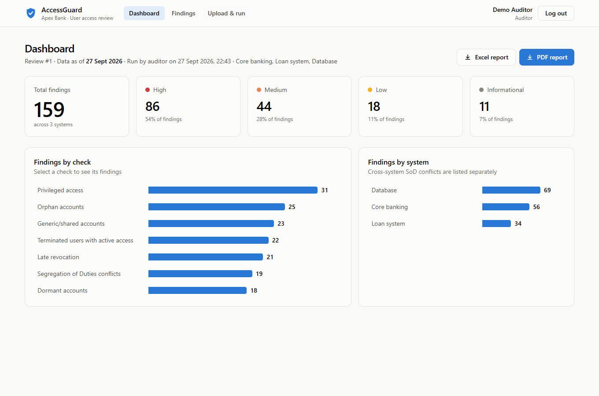
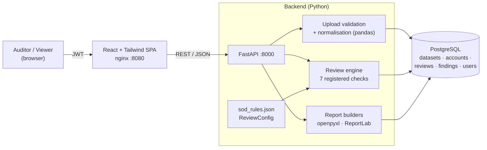
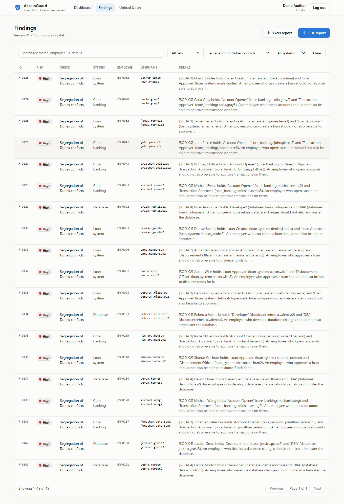
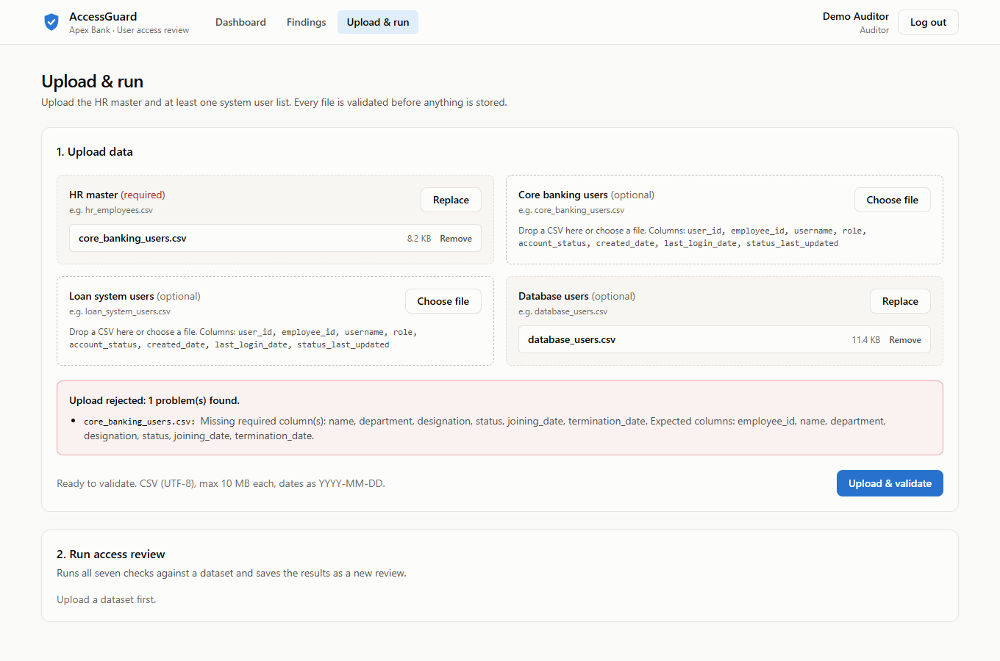
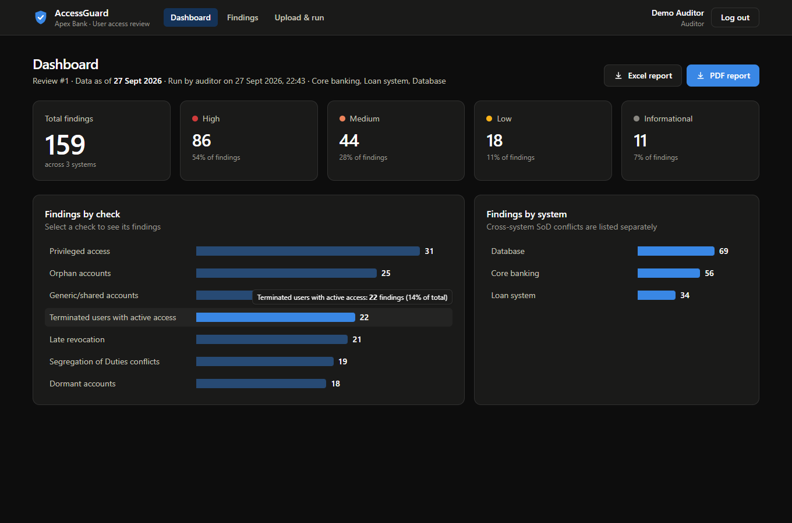
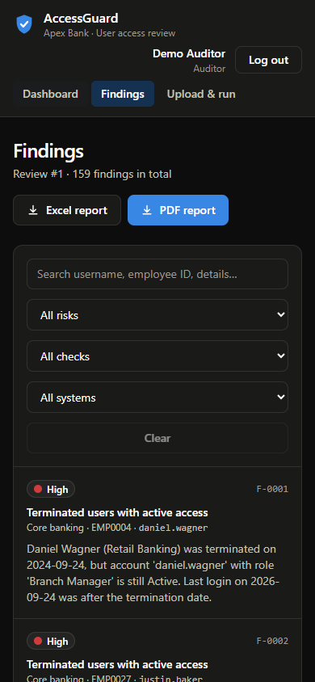
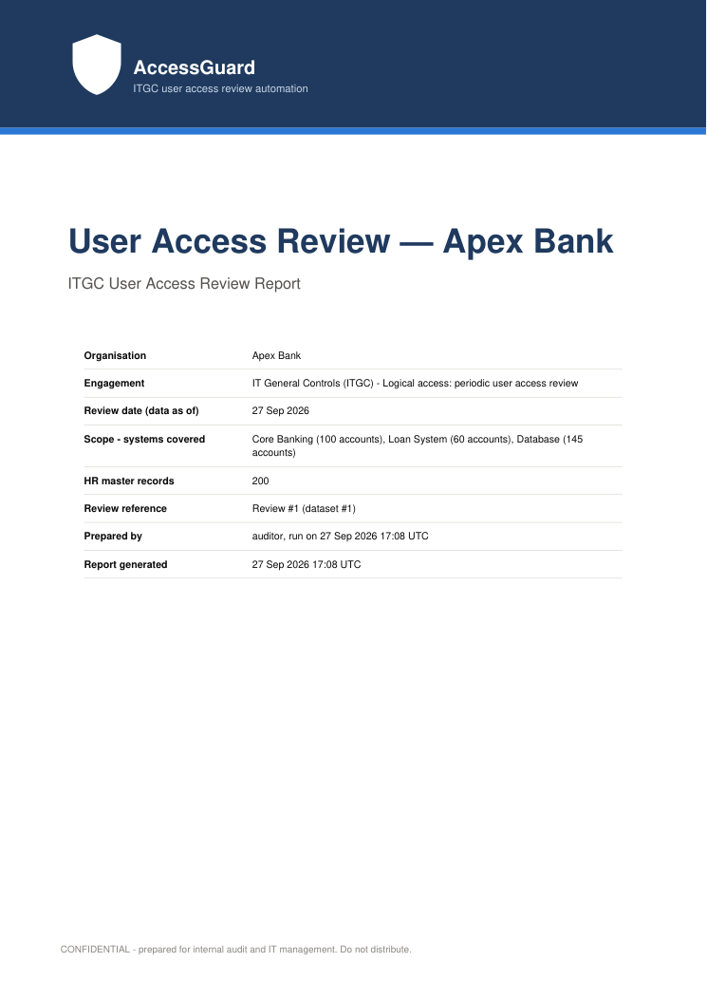
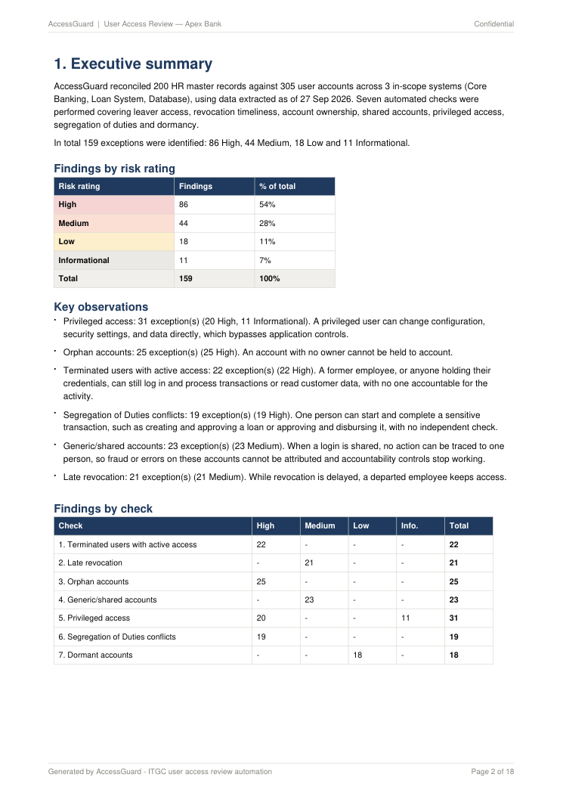
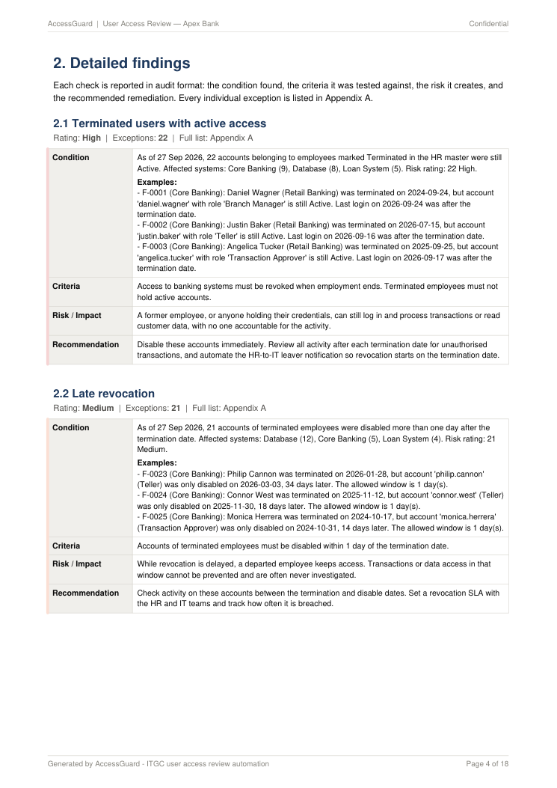
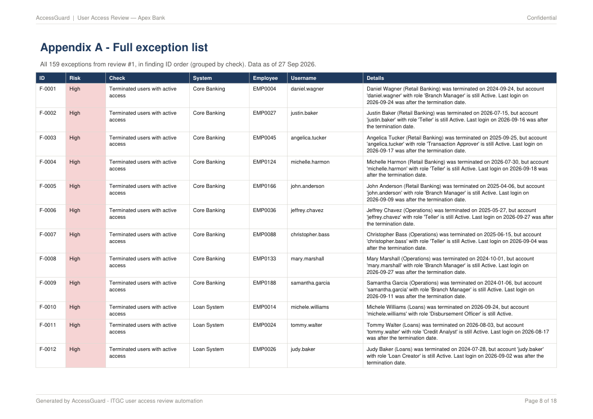

# AccessGuard — ITGC User Access Review Automation for Banking

[](https://github.com/vikas-dev-123/AccessGuard/actions/workflows/ci.yml)

AccessGuard automates the **User Access Review (UAR)** that IT auditors perform during ITGC testing at banks. It matches the HR employee master against user lists exported from banking systems, flags access exceptions, rates each one by risk, and produces an audit-ready Excel workbook and PDF report.



**Highlights**
- **Seven audit checks**, each in its own module with its own tests: leavers with active access, late revocation, orphan accounts, generic accounts, privileged access, Segregation of Duties conflicts, and dormant accounts.
- **Configurable rules.** SoD conflicts live in `sod_rules.json` (within or across systems). The dormancy threshold, revocation grace period, privileged roles and generic-username patterns are all settings.
- **Strict upload validation.** A rejected upload lists every column, row and format problem across all files at once.
- **Audit-format reporting.** A PDF with cover, executive summary, Condition / Criteria / Risk-Impact / Recommendation findings and a full appendix, plus an Excel workbook with one sheet per check.
- **Role-based access** with JWT: an Auditor uploads data and runs reviews; a Viewer has read-only access.
- **Full stack in one command.** `docker compose up` starts React, FastAPI and PostgreSQL. 86 pytest tests run in GitHub Actions CI.

---

## Contents

- [ITGC background: what a user access review is](#itgc-background-what-a-user-access-review-is)
- [Checks and the risks they address](#checks-and-the-risks-they-address)
- [Architecture](#architecture)
- [Quick start (Docker)](#quick-start-docker)
- [Local development](#local-development)
- [Sample data](#sample-data)
- [Configuration](#configuration)
- [API](#api)
- [Audit reports](#audit-reports)
- [Testing](#testing)
- [Project structure](#project-structure)
- [Extending AccessGuard](#extending-accessguard)
- [Screenshots](#screenshots)
- [Design notes](#design-notes)

---

## ITGC background: what a user access review is

**IT General Controls (ITGC)** are the controls auditors test to decide whether they can rely on a bank's IT systems for accurate financial and operational data. **Logical access** is one of the core ITGC domains, and its key control is the **periodic user access review**. The review confirms that only current, authorised people have access to sensitive systems such as core banking, loan origination and databases, at a privilege level that fits their job.

During a UAR, an IT auditor typically:

1. Obtains the **HR master list**: who is employed, in which department, and whether they are active or terminated.
2. Obtains **user listings** from each in-scope system.
3. **Reconciles** the two. Does every account belong to a real, current employee? Was access removed promptly when someone left? Does anyone hold conflicting roles? Are there shared logins or dormant accounts?
4. **Rates each exception by risk.** A leaver who can still approve transactions is High; an unused read-only account is Low.
5. **Writes up findings in audit format** (Condition, Criteria, Risk/Impact, Recommendation) for the workpapers and the management response.

**Why banks need it:** excessive or unrevoked access is one of the most frequent ITGC findings in SOX and regulatory examinations (RBI, OCC, FFIEC and others), because it directly enables fraud, unauthorised transactions and data leakage. Done by hand, the review means spreadsheet lookups across thousands of rows and several systems every quarter, which is slow, error-prone and hard to evidence. AccessGuard automates the reconciliation, risk rating and write-up, so the auditor's time goes into judgment and follow-up.

## Checks and the risks they address

| # | Check | What it detects | Risk it addresses | Rating |
|---|-------|-----------------|-------------------|--------|
| 1 | Terminated users with active access | HR status is Terminated but the system account is still Active | A former employee, or anyone with their credentials, can still log in and transact with no accountability | **High** |
| 2 | Late revocation | Account disabled more than 1 day after the termination date | A window in which a leaver keeps access; activity in that window is rarely investigated | **Medium** |
| 3 | Orphan accounts | Active account with no matching employee in HR | Unowned accounts (contractors, test setups, missed leavers) that no one is accountable for; a common route to fraud | **High** |
| 4 | Generic / shared accounts | Usernames such as `admin`, `test`, `temp`, `teller01`, `shared` | Shared credentials mean actions cannot be traced to one person, which breaks individual accountability | **Medium** |
| 5 | Privileged access | Every active Admin/DBA account, flagged when held outside IT or with no HR record | Business users with admin rights can bypass application controls and change data or configuration directly | **High** outside IT / **Informational** inside IT |
| 6 | Segregation of Duties conflicts | One employee holds a conflicting role pair from `sod_rules.json`, within or across systems | One person can create and approve a loan, or approve and disburse it, with no independent check | **High** |
| 7 | Dormant accounts | Active account with no login for 90+ days (configurable) | Unused accounts go unwatched, so they are easy to misuse, and they suggest access isn't removed when roles change | **Low** |

Default SoD rules: Loan Creator + Loan Approver, Loan Approver + Disbursement Officer, Account Opener + Transaction Approver, and Developer + DBA.

## Architecture



**How a review flows through the system**

1. **Upload** (`POST /upload`, Auditor only): the HR master plus one to three system user lists are validated. Nothing is stored unless every file passes. Valid files become an immutable **dataset**.
2. **Run** (`POST /reviews/run`): the dataset is loaded into pandas and each account is joined to HR. Every registered check runs against the result, and the findings are saved as a **review** with an as-of date.
3. **Explore** (dashboard and findings pages): summaries by risk, check and system, plus server-side filtering, search and paging.
4. **Report** (`/reviews/{id}/report/excel` and `/pdf`): both reports are generated on demand from the stored findings, so old reviews can always be re-reported exactly as they were.

## Quick start (Docker)

Requires Docker with Compose v2.

```bash
git clone https://github.com/vikas-dev-123/AccessGuard.git
cd AccessGuard
docker compose up -d --build
```

| Service | URL |
|---------|-----|
| Web app | http://localhost:8080 |
| API + Swagger UI | http://localhost:8000/docs |
| PostgreSQL | internal to the Compose network |

**Demo walkthrough**
1. Open http://localhost:8080 and sign in as **auditor**. You can click the demo account on the login page to fill in the credentials.
2. Go to **Upload & run** and upload the four CSVs from [`backend/data/`](backend/data/).
3. Set the as-of date to **2026-09-27** (the sample data's extract date) and click **Run review**.
4. Explore the dashboard. Every tile and bar links to the matching filtered findings. Download the Excel and PDF reports.
5. Sign in as **viewer** to see the read-only experience.

| Username | Password | Role | Can |
|----------|----------|------|-----|
| `auditor` | `Auditor@123` | Auditor | Upload data, run reviews, view everything |
| `viewer` | `Viewer@123` | Viewer | View reviews, findings, summaries and reports |

> These are demo credentials. For anything beyond a local demo, set `JWT_SECRET`, `POSTGRES_PASSWORD`, `AUDITOR_PASSWORD` and `VIEWER_PASSWORD` (see [Configuration](#configuration)).

Stop with `docker compose down`, or add `-v` to also delete the database volume.

## Local development

**Backend** (Python 3.12):

```bash
cd backend
python -m venv venv
source venv/bin/activate          # Windows: venv\Scripts\activate
pip install -r requirements.txt
uvicorn app.main:app --reload     # http://localhost:8000; uses SQLite when DATABASE_URL is unset
```

**Frontend** (Node 22+), in a second terminal:

```bash
cd frontend
npm install
npm run dev                       # http://localhost:5173, talks to the API on :8000
```

**Command-line review.** Runs every check on a folder of CSVs without the API or a database:

```bash
cd backend
python -m app.cli --as-of 2026-09-27    # prints a summary and writes output/findings.csv
```

## Sample data

[`backend/scripts/generate_dummy_data.py`](backend/scripts/generate_dummy_data.py) uses Faker to build a fictional **Apex Bank**:

- `hr_employees.csv`: 200 employees across Retail Banking, Loans, Treasury, IT, Operations and Finance (136 active, 64 terminated).
- `core_banking_users.csv` (Teller, Branch Manager, Account Opener, Transaction Approver, Admin), `loan_system_users.csv` (Loan Creator, Loan Approver, Credit Analyst, Disbursement Officer, Admin), and `database_users.csv` (Read Only, Developer, DBA). 305 accounts in total.
- 15–25 deliberately planted exceptions for every check. Running the checks on this data gives **159 findings**: 86 High, 44 Medium, 18 Low and 11 Informational.

The generator is seeded, so `python scripts/generate_dummy_data.py [--output-dir DIR]` reproduces the committed files byte for byte, and a test enforces this.

**File formats** (CSV, UTF-8, dates as `YYYY-MM-DD`):

| File | Columns |
|------|---------|
| HR master | `employee_id, name, department, designation, status, joining_date, termination_date` |
| System users | `user_id, employee_id, username, role, account_status, created_date, last_login_date, status_last_updated` |

`employee_id` may be blank in system files; blank or unknown IDs are what the orphan check catches. `status_last_updated` records when the account status last changed. The late-revocation check uses it to measure how long after termination an account was actually disabled.

## Configuration

Environment variables (backend):

| Variable | Default | Purpose |
|----------|---------|---------|
| `DATABASE_URL` | SQLite file `backend/accessguard.db` | SQLAlchemy URL; Compose sets PostgreSQL |
| `JWT_SECRET` | insecure dev default (a warning is logged) | Signs access tokens |
| `JWT_EXPIRE_MINUTES` | `480` | Token lifetime |
| `CORS_ORIGINS` | `http://localhost:5173,http://localhost:8080` | Allowed browser origins |
| `AUDITOR_USERNAME` / `AUDITOR_PASSWORD` | `auditor` / `Auditor@123` | Seeded auditor account |
| `VIEWER_USERNAME` / `VIEWER_PASSWORD` | `viewer` / `Viewer@123` | Seeded viewer account |
| `ORGANIZATION_NAME` | `Apex Bank` | Name printed on reports |
| `BCRYPT_ROUNDS` | `12` | Password hashing cost |

Frontend: `VITE_API_URL` (default `http://localhost:8000`) is baked in when the frontend image is built. It is the address the *browser* uses to reach the API.

Review rules ([`backend/app/config.py`](backend/app/config.py) → `ReviewConfig`): `dormant_days` (90), `late_revocation_grace_days` (1), `privileged_roles` (`Admin`, `DBA`), `it_department` (`IT`), `generic_username_patterns` (regex list), and `sod_rules` (loaded from [`backend/config/sod_rules.json`](backend/config/sod_rules.json)).

## API

Interactive docs are at `/docs`. Every endpoint except `/auth/login` and `/health` requires `Authorization: Bearer <token>`.

| Method | Endpoint | Role | Purpose |
|--------|----------|------|---------|
| POST | `/auth/login` | – | Form login (`username`, `password`), returns a JWT |
| GET | `/auth/me` | any | Current user |
| POST | `/upload` | Auditor | Multipart: `hr_file` (required) plus at least one of `core_banking_file`, `loan_system_file`, `database_file` |
| GET | `/datasets` | any | Uploaded datasets, newest first |
| GET | `/checks` | any | Check catalogue with condition, criteria, impact and recommendation text |
| POST | `/reviews/run` | Auditor | JSON `{"dataset_id"?, "as_of_date"?}`; defaults to the latest dataset and today |
| GET | `/reviews`, `/reviews/{id}` | any | Review metadata |
| GET | `/reviews/{id}/findings` | any | Filters `system`, `check`, `risk_rating`, `search`; paging `limit`, `offset` |
| GET | `/reviews/{id}/summary` | any | Counts by risk, check and system |
| GET | `/reviews/{id}/report/excel` | any | Excel workbook |
| GET | `/reviews/{id}/report/pdf` | any | PDF audit report |

**Upload validation.** Files are checked for a `.csv` extension, UTF-8 encoding, the 10 MB size limit, required columns, at least one data row, no blank key fields, unique `employee_id`/`user_id`, `YYYY-MM-DD` dates, an HR status of `Active` or `Terminated`, and a termination date for every terminated employee. A rejected upload returns `422` with every problem at once:

```json
{"detail": {"message": "Upload rejected: 2 problem(s) found.", "errors": [
  {"file": "hr_employees.csv", "error": "'status' must be Active or Terminated at row 4."},
  {"file": "loan_system_users.csv", "error": "Missing required column(s): role. Expected columns: ..."}
]}}
```

## Audit reports

**PDF** (ReportLab):
1. **Cover page:** "User Access Review — Apex Bank", review date, systems in scope with account counts, HR record count, review reference and preparer.
2. **Executive summary:** scope and approach, findings by risk rating, key observations ranked by severity, and findings by check as a table and a bar chart.
3. **Detailed findings:** one block per check in audit format. The **Condition** is generated from the actual results: counts, affected systems, risk split and example exceptions. **Criteria**, **Risk / Impact** and **Recommendation** come from the check's definition. A check with no exceptions is reported as "No exceptions were identified".
4. **Appendix A:** every exception, on landscape pages with a repeating header row.

Every page after the cover has a running header, a "Confidential" marker and "Page X of Y".

**Excel** (openpyxl):
- **Summary sheet:** review metadata, findings by risk (with %), findings by check split by risk (each linked to its sheet), and findings by system.
- **One sheet per check:** the Condition, Criteria, Risk / Impact and Recommendation write-up, then that check's findings as a filterable Excel table with risk-tinted cells.
- **All Findings:** every exception in one filterable table.

## Testing

```bash
cd backend
pytest            # 86 tests, about 15 seconds
```

| Area | What is covered |
|------|-----------------|
| Each check (`test_<check>.py`) | Small hand-built fixtures with known exceptions: positive and negative cases, boundaries (e.g. exactly 1 day late, exactly 90 days idle), case and whitespace handling, and configurable thresholds and rules |
| Review engine (`test_review.py`) | Check registration order, finding IDs and timestamps, summaries, CSV normalisation, SoD rule validation |
| Sample data (`test_generated_dataset.py`, `test_data_generator.py`) | 15–25 exceptions per check; the generator is deterministic and matches the committed CSVs |
| API (`test_api_*.py`) | Login, 401/403 role enforcement, upload validation errors, review run, filters, search, paging |
| Reports (`test_reports.py`) | Excel sheets, tables and totals; PDF sections, page numbering, landscape appendix; the zero-findings case |

API tests use in-memory SQLite. The Docker stack runs the same code on PostgreSQL.

CI ([`.github/workflows/ci.yml`](.github/workflows/ci.yml)) runs on every push to `main`:
- the backend tests,
- a type-check and production build of the frontend,
- a `docker compose up --wait` smoke test of the whole stack.

## Project structure

```
AccessGuard/
├── backend/
│   ├── app/
│   │   ├── checks/           # One module per audit check, registered with @register_check
│   │   ├── api/              # FastAPI routers: auth, uploads, reviews and reports
│   │   ├── services/         # Upload validation/ingest; review execution and queries
│   │   ├── reports/          # Report data, Excel builder, PDF builder
│   │   ├── config.py         # ReviewConfig: thresholds, roles, patterns, SoD rules
│   │   ├── data_loading.py   # CSV reading and normalisation
│   │   ├── review.py         # Runs checks, assigns finding IDs, summarises
│   │   ├── models.py         # SQLAlchemy models
│   │   ├── auth.py           # JWT, bcrypt, role dependencies
│   │   ├── main.py           # FastAPI app
│   │   └── cli.py            # Command-line review runner
│   ├── config/sod_rules.json
│   ├── data/                 # Sample Apex Bank CSVs
│   ├── scripts/generate_dummy_data.py
│   ├── tests/
│   └── Dockerfile
├── frontend/
│   ├── src/pages/            # Login, Dashboard, Findings, Upload & run
│   ├── src/components/       # Stat tiles, bar charts, risk badges, layout
│   ├── src/api.ts            # Typed API client
│   ├── Dockerfile            # Node build → nginx
│   └── nginx.conf
├── docs/screenshots/
├── .github/workflows/ci.yml
└── docker-compose.yml
```

## Extending AccessGuard

**Add a check.** Create a module in `backend/app/checks/` and register a function that takes a `ReviewContext` and returns findings:

```python
@register_check(
    code="password_never_changed",
    name="Passwords never changed",
    condition="active accounts have never changed their initial password.",  # reads after a count
    criteria="...", impact="...", recommendation="...",
)
def check_password_never_changed(ctx: ReviewContext) -> list[Finding]:
    ...
```

Import it in `app/checks/__init__.py`. The review runner, summaries, API filters, dashboard, and both reports pick it up automatically.

**Add an SoD rule.** Append to `backend/config/sod_rules.json`. A rule can span systems, and can list more than two roles:

```json
{ "rule_id": "SOD-05", "description": "...",
  "conflicting_roles": [ { "system": "core_banking", "role": "Account Opener" },
                         { "system": "loan_system",  "role": "Loan Approver" } ] }
```

## Screenshots

**Findings.** Server-side filters, search and paging, shown here filtered to SoD conflicts.



**Upload validation.** Every problem in every file is reported at once, before anything is stored.



**Dark mode and mobile.** The app follows the OS theme; findings become cards on small screens.

<p>
  
  
</p>

**PDF audit report.** Cover, executive summary, a detailed finding in audit format, and the appendix.

<p>
  
  
  
</p>



## Design notes

- **Only access that exists today is judged.** The orphan, generic, privileged, SoD and dormant checks look at Active accounts only, because a disabled account grants no access. Late revocation looks only at disabled accounts, by definition.
- **The as-of date is the extract date, not the run date.** Dormancy is measured back from the date the data was extracted, so re-running an old extract gives the same answer.
- **Datasets and reviews are immutable.** Each upload and each run is stored separately, so past results and reports stay reproducible for audit evidence.
- **One finding can appear under several checks.** For example, a shared `backup_admin` account can be both a generic account and part of an SoD conflict. This matches how auditors report overlapping exceptions.
- **Out of scope for a portfolio build:** schema migrations (tables are created on startup), user management beyond the two seeded roles, and connectors that pull user lists directly from source systems.
